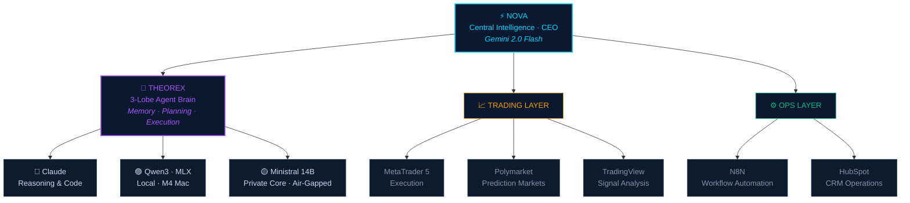
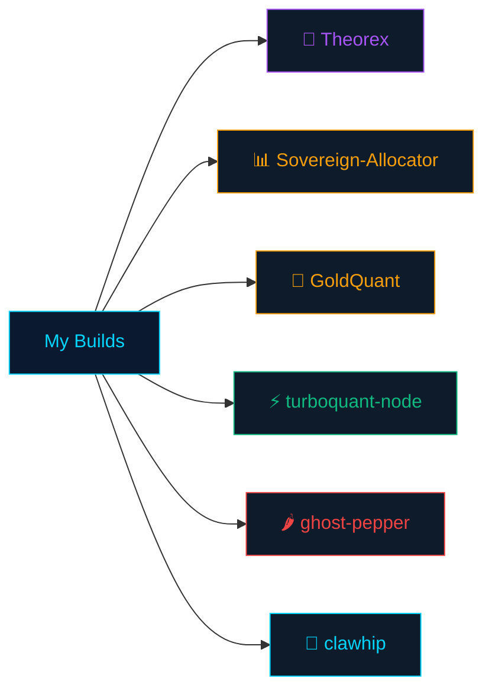
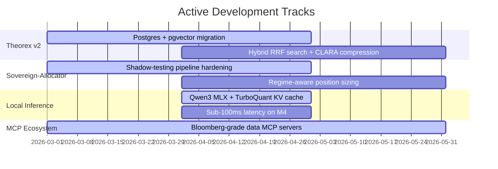

<div align="center">
  
</div>

<br/>

<div align="center">
  <a href="https://github.com/LORD-ZYTHOZ">
    
  </a>
</div>

<br/>

<div align="center">
  
  &nbsp;
  
  &nbsp;
  
  &nbsp;
  
</div>

<br/>

---

## ⚡ About

```typescript
const LORD_ZYTHOZ = {
  location:   "Sydney, Australia 🇦🇺",
  role:       "AI Systems Architect & Autonomous Trading Engineer",
  focus:      ["Multi-agent orchestration", "Local LLM inference", "Quant trading"],
  brain:      "Theorex — 3-lobe agent memory with semantic decay & boot injection",
  stack:      ["Python", "TypeScript", "Rust", "Gemini", "Claude", "Qwen3", "MLX"],
  infra:      "Apple Silicon M4 · Tailscale · pgvector · N8N · FastAPI",
  trading:    ["XAUUSD", "Polymarket", "MetaTrader 5", "TradingView"],
  philosophy: "Sovereign infra. My models. My rules. Agents that earn their keep.",
};
```

---

## 🏗️ Sovereign Command Architecture

> The system I'm building — Nova routes, Theorex remembers, agents execute.



---

## 🚀 Projects

<details open>
<summary><b>🔬 Core Builds — systems I designed from scratch</b></summary>

<br/>



<table>
  <thead>
    <tr>
      <th align="left">Project</th>
      <th align="left">What it does</th>
      <th align="left">Stack</th>
    </tr>
  </thead>
  <tbody>
    <tr>
      <td><a href="https://github.com/LORD-ZYTHOZ/Theorex"><b>🧠 Theorex</b></a></td>
      <td>AI-native 3-lobe agent brain. Concept web with semantic decay, memory promotion, and context injection at boot. The reasoning core behind everything I run.</td>
      <td><code>TypeScript</code> <code>pgvector</code> <code>Postgres</code></td>
    </tr>
    <tr>
      <td><a href="https://github.com/LORD-ZYTHOZ/Sovereign-Allocator"><b>📊 Sovereign-Allocator</b></a></td>
      <td>Autonomous hedge fund architecture. Nova as CEO, Ministral as private reasoning core, shadow-testing pipeline, always-online agents with auto-restart on failure.</td>
      <td><code>Python</code> <code>Gemini</code> <code>Claude</code></td>
    </tr>
    <tr>
      <td><a href="https://github.com/LORD-ZYTHOZ/GoldQuant"><b>🥇 GoldQuant</b></a></td>
      <td>Quantitative XAUUSD trading framework — regime detection, signal aggregation, and agent-driven order execution through MetaTrader 5.</td>
      <td><code>Python</code> <code>MetaTrader 5</code></td>
    </tr>
    <tr>
      <td><a href="https://github.com/LORD-ZYTHOZ/turboquant-node"><b>⚡ turboquant-node</b></a></td>
      <td>TurboQuant (ICLR 2026) for Node.js/Bun via napi-rs. MLX KV cache for Qwen3 on Apple Silicon. 5x compression at 3-bit with 99.5% attention fidelity. Production bug fixes included.</td>
      <td><code>Python</code> <code>Bun</code> <code>napi-rs</code> <code>MLX</code></td>
    </tr>
    <tr>
      <td><a href="https://github.com/LORD-ZYTHOZ/ghost-pepper"><b>🌶️ ghost-pepper</b></a></td>
      <td>Hold-to-talk STT for macOS. 100% local — WhisperKit transcription + local LLM cleanup. Hold Control to record, release to transcribe and paste. Zero cloud dependency.</td>
      <td><code>Swift</code> <code>WhisperKit</code> <code>Ollama</code></td>
    </tr>
    <tr>
      <td><a href="https://github.com/LORD-ZYTHOZ/clawhip"><b>🔔 clawhip</b></a></td>
      <td>Event-to-channel notification router. Bypasses gateway sessions to prevent context pollution in long-running agent pipelines. Keeps agents clean.</td>
      <td><code>Python</code> <code>WebSockets</code></td>
    </tr>
  </tbody>
</table>

</details>

<details>
<summary><b>📦 Active Forks — tools I'm running in production</b></summary>

<br/>

| Project | Why I use it |
|---|---|
| [**TradingAgents**](https://github.com/LORD-ZYTHOZ/TradingAgents) | Multi-LLM financial trading framework feeding into Sovereign-Allocator |
| [**ai-hedge-fund**](https://github.com/LORD-ZYTHOZ/ai-hedge-fund) | Reference architecture for autonomous fund management patterns |
| [**turboquant**](https://github.com/LORD-ZYTHOZ/turboquant) | Rust: TurboQuant + PolarQuant + QJL — zero-overhead vector quantization |
| [**mempalace**](https://github.com/LORD-ZYTHOZ/mempalace) | Highest-scoring AI memory benchmark — comparing against Theorex |
| [**momentum-mcp**](https://github.com/LORD-ZYTHOZ/momentum-mcp) | Bloomberg-style MCP for stock screening and OHLCV data |
| [**tradingview-mcp-jackson**](https://github.com/LORD-ZYTHOZ/tradingview-mcp-jackson) | TradingView chart analysis piped directly into Claude |
| [**camofox-browser**](https://github.com/LORD-ZYTHOZ/camofox-browser) | Headless browser automation for agents hitting bot-protected sites |
| [**deer-flow**](https://github.com/LORD-ZYTHOZ/deer-flow) | Long-horizon superagent harness — research, code, create with sandboxes |

</details>

<details>
<summary><b>🔩 Infrastructure & Tooling</b></summary>

<br/>

| Project | What it is |
|---|---|
| [**HedgeFund-V2**](https://github.com/LORD-ZYTHOZ/HedgeFund-V2) | Second-gen hedge fund agent stack — cleaner orchestration layer |
| [**mission-control**](https://github.com/LORD-ZYTHOZ/mission-control) | Self-hosted agent orchestration platform with spend monitoring |
| [**xyops**](https://github.com/LORD-ZYTHOZ/xyops) | Complete workflow automation and server monitoring system |
| [**codedb**](https://github.com/LORD-ZYTHOZ/codedb) | Zig code intelligence MCP server for AI agents |
| [**EverMemOS**](https://github.com/LORD-ZYTHOZ/EverMemOS) | Memory OS for agents — personal context without token waste |
| [**GLM-5**](https://github.com/LORD-ZYTHOZ/GLM-5) | From vibe coding to agentic engineering methodology |

</details>

---

## 🛠️ Full Stack

<details>
<summary><b>Open</b></summary>

<br/>

**🤖 AI & LLMs**

```
Claude · Gemini 2.0 Flash · Qwen3 · Ministral 14B · LM Studio
MLX · pgvector · HyDE embeddings · MCP protocol · RAG pipelines
```

**📈 Trading**

```
MetaTrader 5 · TradingView · Polymarket · XAUUSD
Signal aggregation · Regime detection · Quantitative analysis
Autonomous execution · Shadow-testing pipelines
```

**💻 Languages**

```
Python · TypeScript · Rust · JavaScript · Bash · SQL
```

**🏗️ Infrastructure**

```
FastAPI · Supabase · PostgreSQL · pgvector · Docker
N8N · PM2 · Tailscale · Apple Silicon M4 · Multi-device LAN mesh
```

**🧩 Agent Frameworks**

```
Custom multi-agent orchestration · Hierarchical swarm design
Fault-tolerant coordination · MCP servers · PARA memory architecture
```

</details>

---

## 🧠 Current Focus

<details open>
<summary><b>What I'm actively building right now</b></summary>

<br/>



- **Theorex v2** — migrating Axon JSON → Postgres + pgvector, adding hybrid RRF search and CLARA compression (32x memory density target)
- **Sovereign-Allocator** — hardening the shadow-testing pipeline, wiring in regime-aware position sizing for XAUUSD
- **Local inference** — Qwen3 on MLX with TurboQuant KV cache, targeting sub-100ms on M4 with 3-bit compression
- **MCP ecosystem** — custom servers giving agents Bloomberg-grade market data access without API costs

</details>

---

## 📊 Stats

<div align="center">
  
  &nbsp;
  
</div>

<br/>

<div align="center">
  
</div>

<br/>

<div align="center">
  
</div>

---

<div align="center">
  
</div>

<br/>

<div align="center">
  
</div>

